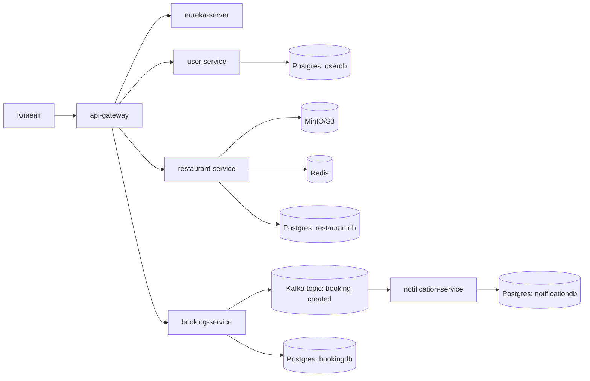

# RBS — Restaurant Booking System

RBS — микросервисная backend-система для бронирования столиков в ресторанах с хранением медиа (S3/MinIO), кэшированием (Redis) и асинхронными уведомлениями по email (Kafka).

---

## Содержание

* [Цели проекта](#цели-проекта)
* [Технологический стек](#технологический-стек)
* [Микросервисы](#микросервисы)
  * [Eureka Server](#1-eureka-server-discovery-service)
  * [API Gateway](#2-api-gateway)
  * [Restaurant Service](#3-restaurant-service)
  * [Booking Service](#4-booking-service)
  * [User Service](#5-user-service)
  * [Notification Service](#6-notification-service)
  * [Common Module](#7-common-module)
* [Контракты API (пример)](#контракты-api-пример)
* [Безопасность](#безопасность)
* [Кэширование](#кэширование)
* [Событийная модель (Kafka)](#событийная-модель-kafka)
* [Конфигурация и окружение](#конфигурация-и-окружение)
* [Docker / Docker Compose](#docker--docker-compose)

---

## Цели проекта

### Бизнес-цели

* Дать пользователю возможность:

  * посмотреть ресторан/столы/блюда,
  * создать бронирование на конкретное время,
  * получить подтверждение брони (email).
* Дать владельцу/менеджеру ресторана возможность:

  * управлять рестораном, столами, блюдами,
  * загружать и управлять медиа-контентом (баннер/галерея/схема).

### Инженерные цели

* **Микросервисная архитектура** с чёткими границами доменов.
* **Изоляция данных**: каждая БД принадлежит одному сервису.
* **Единая точка входа** через API Gateway.
* **Единая модель безопасности** на основе JWT.
* **Асинхронность** для side-effects (email) через Kafka.
* **Идемпотентность** и повторные попытки (retry) для доставки уведомлений.
* Подготовка основы под дальнейшие фичи:

  * динамическое ценообразование,
  * рекомендации,
  * распределённые трассировки,
  * масштабирование.

---

## Технологический стек

### Язык и платформа

* Java 17
* Spring Boot 3.4.x
* Spring Cloud 2024.x

### Инфраструктура

* PostgreSQL (для бизнес-данных)
* Redis (кэш и быстрые структуры)
* Kafka (KRaft, event streaming)
* MinIO (S3-совместимое хранилище)
* Docker / Docker Compose

### Интеграции и подходы

* REST для синхронных запросов (внутренние/публичные)
* Kafka events для асинхронных операций
* Presigned URLs для загрузки файлов напрямую в S3/MinIO
* Actuator для наблюдаемости

---

## Микросервисы

Ниже — роль каждого сервиса, его ответственность и типичные сценарии.

### Схема взаимодействий (высокий уровень)



---

### 1) Eureka Server (Discovery Service)

**Назначение:** Service Discovery (реестр сервисов).
Все сервисы регистрируются в Eureka, а gateway использует discovery для маршрутизации (`lb://service-name`).

**Что даёт:**

* отсутствие “жёстких” адресов сервисов,
* возможность масштабирования (несколько инстансов одного сервиса),
* динамическое обнаружение.

**Типичные операции:**

* Просмотр зарегистрированных сервисов в UI Eureka.
* Диагностика доступности сервисов.

---

### 2) API Gateway

**Назначение:** единая точка входа во всю систему.

**Ключевые обязанности:**

* Проверка **access JWT** (HS256).
* Проверка `issuer` (кто выпустил токен).
* Проверка `token_type == access_token` (защита от использования refresh вместо access).
* Маршрутизация запросов к нужному сервису:

  * либо через discovery locator (`/{serviceId}/...`),
  * либо через явные routes (если ты их включишь/добавишь).

**Почему так:**

* безопасность централизуется,
* сервисы проще (не обязаны каждый раз реализовывать полноценный security-периметр).

**Важно:**

* Публичные endpoint’ы (например `/api/v1/auth/**`) должны быть разрешены на gateway.
* Остальные требуют `Authorization: Bearer <access_token>`.

---

### 3) Restaurant Service

**Назначение:** управление ресторанным контентом и медиа.

**Ответственность:**

* CRUD ресторана:

  * имя, описание, адрес, метаданные
* CRUD столов:

  * номер/описание/вместимость
* CRUD блюд:

  * название/описание/цена/медиа
* Медиа:

  * загрузка изображений через presigned URL
  * статусы жизненного цикла фото (например: `PENDING/ACTIVE/EXPIRED/DELETING`)
  * уборка (cleaner) неактуальных/просроченных объектов

**Интеграции:**

* **MinIO (S3)**:

  * объектное хранилище изображений
  * presigned upload / confirm
* **Redis**:

  * ускорение чтения “тяжёлых” объектов (например карточка ресторана / список блюд / изображения)

**Границы безопасности:**

* операции создания/изменения доступны владельцу/менеджеру,
* публичное чтение может быть доступно всем (зависит от твоих правил).

---

### 4) Booking Service

**Назначение:** домен бронирований и публикация событий.

**Ответственность:**

* Создание бронирования:

  * ресторан + стол + временной интервал
  * количество гостей
  * комментарий
  * итоговая стоимость (если есть)
* Получение бронирования:

  * по ID
  * список “моих броней”
* Отмена бронирования
* Публикация доменного события:

  * `booking-created` в Kafka после успешного создания

**Интеграции (синхронные):**

* user-service — получить данные пользователя (минимально необходимые)
* restaurant-service — получить “снимок” данных ресторана/стола (booking snapshot), чтобы:

  * не тащить зависимость на restaurant-db,
  * иметь нужные данные для события и ответа

**Интеграции (асинхронные):**

* Kafka producer → `booking-created`

---

### 5) User Service

**Назначение:** identity & access.

**Ответственность:**

* Регистрация пользователя
* Логин
* Refresh токенов (ротация refresh)
* Logout (инвалидация refresh)
* Управление ролями (например USER/MANAGER/ADMIN) — если предусмотрено

**JWT модель (важно):**

* **Access token**

  * короткоживущий
  * содержит `roles`, `email`, `token_type=access_token`
* **Refresh token**

  * долгоживущий
  * содержит `jti`, `token_type=refresh_token`
  * JTI хранится в БД (обычно в виде хэша), чтобы:

    * делать logout,
    * блокировать старые refresh после обновления,
    * сбрасывать refresh при смене роли

---

### 6) Notification Service

**Назначение:** доставка email на основе событий.

**Ответственность:**

* Kafka consumer `booking-created`
* Создание записи “сообщение” в БД (inbox/outbox-подобный подход)
* Идемпотентность:

  * если событие пришло повторно — не отправлять письмо дважды
* Retry:

  * периодически повторять отправку “застрявших/ошибочных” сообщений
* Отправка email:

  * шаблонизация (например Thymeleaf)
  * HTML письмо подтверждения бронирования

**Почему это отдельный сервис:**

* email — side effect, его лучше вынести из критического пути бронирования,
* не блокировать пользователя на сетевых/SMTP задержках,
* проще масштабировать и ретраить.

---

### 7) Common Module

**Назначение:** общая библиотека для всех сервисов.

Обычно тут лежат:

* единый формат ошибок (ApiError)
* базовые исключения (ApiException)
* глобальный обработчик ошибок (CommonExceptionHandler)
* общие утилиты (например работа с локализацией/MessageSource)
* единый подход к логированию ошибок (warn для 4xx, error для 5xx)

**Зачем:**

* одинаковые ответы об ошибках во всех сервисах,
* меньше копипаста,
* проще сопровождать.

---

## Контракты API (пример)


### 1) Регистрация / Логин / Refresh

**Регистрация**

```http
POST /api/v1/auth/register
Content-Type: application/json

{
  "email": "user@example.com",
  "password": "StrongPassword123"
}
```

**Логин**

```http
POST /api/v1/auth/login
Content-Type: application/json

{
  "email": "user@example.com",
  "password": "StrongPassword123"
}
```

**Ответ**

```json
{
  "accessToken": "eyJhbGciOiJIUzI1NiIs...",
  "refreshToken": "eyJhbGciOiJIUzI1NiIs..."
}
```

**Refresh**

```http
POST /api/v1/auth/refresh
Content-Type: application/json

{
  "refreshToken": "..."
}
```

---

### 2) Рестораны

**Создать ресторан**

```http
POST /api/v1/restaurants
Authorization: Bearer <access_token>
Content-Type: application/json

{
  "name": "My Restaurant",
  "description": "Cozy place",
  "address": "Amsterdam"
}
```

**Получить ресторан**

```http
GET /api/v1/restaurants/{restaurantId}
Authorization: Bearer <access_token>   (или публично — зависит от твоих правил)
```

---

### 3) Бронирование

**Создать бронь**

```http
POST /api/v1/bookings
Authorization: Bearer <access_token>
Content-Type: application/json

{
  "restaurantId": "UUID",
  "tableId": "UUID",
  "startAt": "2026-03-01T18:00:00Z",
  "endAt": "2026-03-01T20:00:00Z",
  "guests": 2,
  "comment": "Near window"
}
```

**Сценарный результат:**

* booking-service создаёт запись
* публикует `booking-created`
* notification-service отправляет письмо

---

## Безопасность

### 1) Где проверяется JWT

* На **API Gateway**:

  * валидируется подпись (HS256),
  * проверяется `issuer`,
  * проверяется `token_type`.

Это защищает внутренние сервисы от:

* невалидных токенов,
* подмены refresh/access,
* запросов без авторизации.

### 2) Роли и доступ

Типичная модель:

* USER: бронирования, просмотр
* MANAGER: управление рестораном
* ADMIN: административные операции

Рекомендуемая практика:

* минимизировать роль-логику в gateway,
* проверку полномочий “глубже” делать на сервисе (например restaurant-service знает, кто владелец ресторана).

### 3) Refresh-токены

Ротация refresh токена должна:

* деактивировать старый refresh JTI
* выдавать новый refresh
* по logout деактивировать текущий refresh

### 4) Рекомендации для production

* секреты только через ENV / Vault / secret storage
* запретить дефолтные значения секретов
* настроить CORS/Rate limit на gateway
* добавить аудит-лог для критичных операций (смена роли, удаление ресторана)

---

## Кэширование

### Что кэшируем

В restaurant-service обычно выгодно кэшировать:

* карточку ресторана (`restaurantId -> RestaurantResponse`)
* список блюд ресторана
* список столов
* список активных фото

### Где кэшируем

* Redis (внешний кэш)
* TTL на ключи (например 5–30 минут), зависит от “живости” данных

### Инвалидация

Рекомендуемая стратегия:

* при изменении ресторана/блюда/стола — удалять соответствующие ключи
* при загрузке/удалении фото — инвалидировать фото-ключи ресторана/блюда

---

## Событийная модель (Kafka)

### Topic’и

* `booking-created` — событие о создании бронирования

### Смысл события

Событие должно содержать минимально достаточную информацию, чтобы notification-service мог:

* отправить письмо
* не ходить синхронно в другие сервисы

Обычно в событии полезно иметь:

* `bookingId`
* `startAt`, `endAt`
* `guests`
* `totalAmount` (если есть)
* данные ресторана и стола (снапшот)
* `email` пользователя (если письмо отправляется пользователю)

### Идемпотентность

Notification-service должен:

* иметь уникальный `messageId` (например равный bookingId)
* хранить обработанные id в БД
* при повторной доставке события не отправлять письмо повторно

### Retry

Паттерн:

* consumer сохраняет “сообщение” и пытается отправить
* если ошибка — выставляет FAILED
* scheduler раз в N минут пробует снова до maxAttempts

---

## Конфигурация и окружение

### Обязательные переменные окружения (рекомендуемый минимум)

**Базы данных**

* `DB_HOST`, `DB_PORT`
* `DB_USER`, `DB_PASS`

**Eureka**

* `EUREKA_URL` (например `http://eureka-server:8761/eureka` в docker-сети)

**Kafka**

* `KAFKA_HOST`, `KAFKA_PORT`
* (важно) внутри docker обычно нужен `kafka:29092`, а не `localhost:9092`

**MinIO**

* `MINIO_ENDPOINT`
* `MINIO_ACCESS_KEY`
* `MINIO_SECRET_KEY`

**JWT**

* `JWT_SECRET` (access)
* `JWT_REFRESH_SECRET` (refresh)
* TTL’ы (access/refresh)

**Email**

* SMTP host/port
* username/password
* from address

---

## Docker / Docker Compose

### Что поднимается

* Postgres
* Redis
* Kafka (KRaft)
* MinIO
* * сервисы приложения

### Запуск

```bash
docker compose up -d
```

### Проверки после запуска

* Eureka UI: `http://localhost:8761`
* Gateway health: `http://localhost:8080/actuator/health`

---

## Лицензия и условия использования

Данный проект **НЕ является open-source**.

Исходный код размещён в открытом доступе **исключительно
для ознакомления**.

Любое использование кода, включая (но не ограничиваясь):
запуск, компиляцию, модификацию, копирование, распространение,
деплой или включение в другие проекты, **запрещено** без
предварительного письменного согласия автора.

© 2026 this-is-lama. Все права защищены.

---