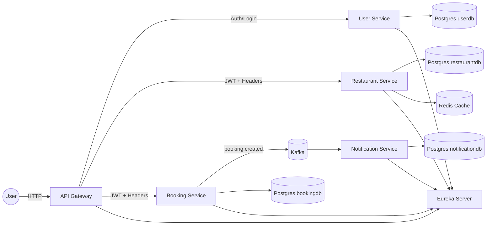

# RBS — Online Restaurant Booking System (Дипломный проект)

Микросервисная система для онлайн-бронирования ресторанов: пользователи выбирают ресторан и столик, создают бронирование, получают уведомления, а администраторы управляют справочными данными (рестораны, меню, столы).  
Проект демонстрирует современные практики построения распределённых систем на **Java + Spring Boot**: сервис-дискавери, API Gateway, межсервисное взаимодействие, кэширование, события (Kafka), контейнеризация (Docker).

---

## Содержание
- [Цели диплома](#цели-диплома)
- [Технологический стек](#технологический-стек)
- [Микросервисы](#микросервисы)
    - [Eureka Server](#1-eureka-server-discovery-service)
    - [API Gateway](#2-api-gateway)
    - [Restaurant Service](#3-restaurant-service)
    - [Booking Service](#4-booking-service)
    - [User Service](#5-user-service)
    - [Notification Service](#6-notification-service)
    - [Common Module](#7-common-module)
- [Контракты API (пример)](#контракты-api-пример)
- [Безопасность](#безопасность)
- [Кэширование](#кэширование)
- [Событийная модель (Kafka)](#событийная-модель-kafka)
- [Конфигурация и окружение](#конфигурация-и-окружение)
- [Docker / Docker Compose](#docker--docker-compose)
- [Наблюдаемость (Actuator)](#наблюдаемость-actuator)
- [Тестирование](#тестирование)
- [План выполнения диплома на 1 месяц](#план-выполнения-диплома-на-1-месяц)
- [Идеи для усиления диплома](#идеи-для-усиления-диплома)

---

## Цели диплома

1. **Построить микросервисную архитектуру** для предметной области “онлайн-бронирование ресторанов”.
2. Реализовать ключевые инфраструктурные паттерны:
    - Service Discovery (Eureka)
    - API Gateway (Spring Cloud Gateway)
    - Cache-aside (Redis)
    - Event-driven (Kafka)
3. Показать **безопасность и разграничение доступа**: роли USER/ADMIN, фильтры на Gateway.
4. Обеспечить развертывание всей системы одной командой через Docker Compose.
5. Продемонстрировать тестирование, наблюдаемость и готовность к масштабированию.

---

## Технологический стек

**Язык и платформа**
- Java 17
- Gradle multi-module (Kotlin DSL)

**Backend**
- Spring Boot (3.x)
- Spring Data JPA (Hibernate)
- Spring Security
- Spring Cloud:
    - Eureka Client/Server
    - OpenFeign (для синхронных вызовов между сервисами)
    - LoadBalancer

**Инфраструктура**
- PostgreSQL (один сервер, несколько баз данных: `userdb`, `bookingdb`, `restaurantdb`, `notificationdb`)
- Redis (кэш справочных данных)
- Kafka (KRaft mode, без ZooKeeper)

**Контейнеризация**
- Docker / Docker Compose
- Универсальный Dockerfile для сборки любого модуля

**Наблюдаемость**
- Spring Boot Actuator (`/actuator/health`, `/actuator/metrics`, …)

---

# 🧩 Mermaid-диаграмма архитектуры (для README.md)

---

## Микросервисы

Ниже — назначение каждого сервиса и **зависимости**, которые обычно используются в каждом модуле.

> Примечание: зависимости перечислены как “минимально корректный набор” для диплома.  
> Ты можешь добавлять/убирать зависимости по мере реализации функций.

---

### 1) Eureka Server (Discovery Service)

**Назначение:**  
Единая точка регистрации микросервисов. Позволяет сервисам находить друг друга по имени (`lb://user-service` и т.п.) и обеспечивает основу для балансировки и отказоустойчивости.

**Порт:** `8761`  
**UI:** `http://localhost:8761`

**Зависимости**
- `spring-boot-starter-web`
- `spring-cloud-starter-netflix-eureka-server`
- `spring-boot-starter-actuator`
- `spring-boot-starter-test` (tests)

---

### 2) API Gateway

**Назначение:**  
Единая точка входа в систему. Реализует:
- маршрутизацию запросов к нужному микросервису,
- security-фильтры (JWT, роли, ограничения),
- централизованную обработку ошибок,
- (опционально) rate limiting / CORS / трассировку.

**Стек:** reactive (WebFlux / Netty)  
**Порт:** `8080`

**Зависимости**
- `spring-cloud-starter-gateway` (включает WebFlux)
- `spring-boot-starter-security` (reactive security)
- `spring-cloud-starter-netflix-eureka-client`
- `spring-boot-starter-actuator`
- Lombok (compileOnly + annotationProcessor)
- Tests: `spring-boot-starter-test`, `reactor-test`

---

### 3) Restaurant Service

**Назначение:**  
Справочный сервис ресторанов. Управляет:
- ресторанами,
- столами,
- меню и блюдами.

Используется Booking Service для проверки доступности и получения информации о столах.

**Порт:** `8081`

**Хранилища**
- PostgreSQL (`restaurantdb`)
- Redis (кэш для read-heavy данных: рестораны/меню/столы)

**Зависимости**
- `spring-boot-starter-web`
- `spring-boot-starter-data-jpa`
- `postgresql` (runtimeOnly)
- `spring-boot-starter-security` (если часть admin-endpoints защищена)
- `spring-boot-starter-data-redis`
- `spring-cloud-starter-netflix-eureka-client`
- `spring-cloud-starter-openfeign`
- `spring-cloud-starter-loadbalancer`
- `spring-boot-starter-actuator`
- Tests: `spring-boot-starter-test`, Testcontainers (postgres/redis по желанию)

---

### 4) Booking Service

**Назначение:**  
Сервис бронирований. Отвечает за:
- создание/отмену/просмотр бронирований,
- проверку столов (через Restaurant Service или кэшированный snapshot),
- генерацию событий для Notification Service.

**Порт:** `8082`

**Хранилища**
- PostgreSQL (`bookingdb`)

**Зависимости**
- `spring-boot-starter-web`
- `spring-boot-starter-data-jpa`
- `postgresql` (runtimeOnly)
- `spring-boot-starter-security` (если нужно ограничить доступ)
- `spring-cloud-starter-netflix-eureka-client`
- `spring-cloud-starter-openfeign`
- `spring-cloud-starter-loadbalancer`
- `spring-kafka` (если Booking публикует события)
- `spring-boot-starter-actuator`
- Tests: `spring-boot-starter-test`, Testcontainers postgres

---

### 5) User Service

**Назначение:**  
Управление пользователями и правами. Типично включает:
- регистрацию/логин,
- хранение профиля,
- роли `USER`/`ADMIN`,
- выдачу/проверку токенов (JWT).

**Порт:** `8083`

**Хранилища**
- PostgreSQL (`userdb`)

**Зависимости**
- `spring-boot-starter-web`
- `spring-boot-starter-security`
- `spring-boot-starter-data-jpa`
- `postgresql` (runtimeOnly)
- `spring-cloud-starter-netflix-eureka-client`
- `spring-boot-starter-actuator`
- Tests: `spring-boot-starter-test`, Testcontainers postgres

---

### 6) Notification Service

**Назначение:**  
Отправка уведомлений пользователям:
- email / push / websocket (опционально),
- обработка событий Kafka (booking created/updated/cancelled),
- ведение статуса доставки уведомлений (опционально в БД).

**Порт:** `8084`

**Хранилища**
- Kafka (consumer)
- PostgreSQL (`notificationdb`) — опционально, если хранишь историю уведомлений

**Зависимости**
- `spring-boot-starter-actuator`
- `spring-kafka` (consumer + тесты)
- `spring-cloud-starter-netflix-eureka-client` (если сервис регистрируется)
- `spring-boot-starter-web` (необязательно, но удобно для тестовых endpoints)
- (опционально) JPA + postgres, если нужна история уведомлений
- Tests: `spring-boot-starter-test`, `spring-kafka-test`

---

### 7) Common Module

**Назначение:**  
Общая библиотека для переиспользования типов между сервисами (без Spring-контекста).

**Что хранить в `common`:**
- DTO (контрактные модели)
- event-модели Kafka (например `BookingCreatedEvent`)
- общие enum’ы (`BookingStatus`)
- общие ошибки/коды ошибок
- утилиты (минимально)

**Что НЕ хранить:**
- JPA Entities
- Spring `@Service`, `@Component`, конфиги
- репозитории

**Зависимости**
- `java-library`
- Lombok (опционально)
- Tests: `junit-jupiter`

---

## Контракты API (пример)

### Restaurant Service (пример публичных endpoints)
- `GET /restaurants` — список ресторанов
- `GET /restaurants/{id}` — ресторан
- `GET /restaurants/{id}/menu` — меню
- `GET /restaurants/{id}/tables` — столы

### Admin endpoints
- `POST /restaurants`
- `PUT /restaurants/{id}`
- `DELETE /restaurants/{id}`
- `POST /restaurants/{id}/menu`
- …

### Booking Service (пример)
- `POST /bookings` — создать бронирование
- `GET /bookings/{id}`
- `GET /bookings?userId=...`
- `DELETE /bookings/{id}` — отменить

> В дипломе полезно описать “публичные” и “admin” endpoints раздельно.

---

## Безопасность

### Централизованная security через Gateway
Базовый подход:
- Gateway проверяет JWT и роли.
- Бизнес-сервисы доверяют Gateway (или дополнительно валидируют токен).

Что можно реализовать в Gateway:
- `GlobalFilter` для извлечения токена
- `SecurityWebFilterChain` для route-level правил:
    - `/restaurants/**` — публично чтение, admin-методы защищены
    - `/bookings/**` — только авторизованным
    - `/admin/**` — только ADMIN

### Роли
- `USER` — может смотреть рестораны, создавать бронирования, смотреть свои брони
- `ADMIN` — управляет ресторанами/меню/столами, может управлять бронированиями (по правилам)

---

## Кэширование

### Где кэшировать
Наиболее логично кэшировать в `Restaurant Service`:
- список ресторанов
- меню ресторана
- список столов

Паттерн: **Cache-Aside**
- чтение: сначала Redis, затем DB → и складываем в Redis
- обновление: при POST/PUT/DELETE инвалидируем кэш

Цель:
- снизить нагрузку на Postgres
- ускорить ответы на “каталог” и “меню” (read-heavy части)

---

## Событийная модель (Kafka)

### События
Booking Service публикует события:
- `booking.created`
- `booking.cancelled`
- `booking.updated` (опционально)

Notification Service подписывается и отправляет уведомление.

### Почему Kafka полезна в дипломе
- показывает асинхронную коммуникацию
- повышает отказоустойчивость
- уменьшает связность сервисов

---

## Конфигурация и окружение

### Переменные окружения (пример)
- `EUREKA_URL=http://eureka-server:8761/eureka`
- `DB_HOST=postgres`
- `DB_PORT=5432`
- `DB_USER=postgres`
- `DB_PASS=postgres`
- `KAFKA_BOOTSTRAP=kafka:9092`
- `REDIS_HOST=redis`
- `REDIS_PORT=6379`

---

## Docker / Docker Compose

### Универсальный Dockerfile
В корне лежит один `Dockerfile`, который собирает любой модуль по `ARG MODULE`.

Пример сборки:
- `MODULE=user-service` → `./gradlew :user-service:bootJar`

### Postgres: один сервер, несколько баз
В `docker/postgres/init/01-create-databases.sql` создаются базы:
- `userdb`
- `bookingdb`
- `restaurantdb`
- `notificationdb`

Postgres создаёт их автоматически **на первом запуске** (в новом volume).

### Kafka: KRaft
Kafka в docker-compose запущена в режиме KRaft (без ZooKeeper).

---

## Наблюдаемость (Actuator)

Для каждого сервиса доступны:
- `GET /actuator/health`
- `GET /actuator/info`
- `GET /actuator/metrics`

Почему важно:
- диагностика
- мониторинг
- проверка “живости” сервисов

---

## Тестирование

### Что тестировать
1. **Unit-тесты**: сервисный слой, валидаторы, мапперы
2. **Web-layer tests**: контроллеры (MockMvc / WebTestClient)
3. **Integration tests**:
    - Postgres через Testcontainers
    - Kafka через embedded kafka / testcontainers (по желанию)
    - Redis (опционально)

### Минимальный набор для диплома
- по 2–3 unit теста на каждый сервис
- интеграционный тест для Booking (создание брони)
- интеграционный тест Kafka (booking event → notification consumer)

---

# RBS — Полный план разработки (от 0 до готового диплома)

**Вариант безопасности:** JWT проверяется **в API Gateway по секрету (HS256)**, User Service **выдаёт** токены.

Этот документ — твой **“пошаговый трекер разработки”**. Он описывает все этапы, критерии готовности (DoD), и как проверять, что всё работает. Можно копировать как отдельный файл в репозиторий, например: `docs/DEVELOPMENT_PLAN.md`.

---

## Содержание

* [1. Общая логика разработки](#1-общая-логика-разработки)
* [2. MVP сценарий (что должно работать первым)](#2-mvp-сценарий-что-должно-работать-первым)
* [3. Архитектура сервисов](#3-архитектура-сервисов)
* [4. Этапы разработки (0 → продакшен-демо)](#4-этапы-разработки-0--продакшен-демо)

    * [0) Подготовка и фиксация требований](#0-подготовка-и-фиксация-требований)
    * [1) Скелет проекта и сборка](#1-скелет-проекта-и-сборка)
    * [2) Инфраструктура: Eureka + Gateway маршрутизация](#2-инфраструктура-eureka--gateway-маршрутизация)
    * [3) Базы данных + миграции](#3-базы-данных--миграции)
    * [4) Common модуль и контракты](#4-common-модуль-и-контракты)
    * [5) User Service: регистрация/логин + выдача JWT](#5-user-service-регистрациялогин--выдача-jwt)
    * [6) API Gateway: JWT валидация по секрету + роли](#6-api-gateway-jwt-валидация-по-секрету--роли)
    * [7) Restaurant Service: справочники + админ CRUD](#7-restaurant-service-справочники--админ-crud)
    * [8) Booking Service: бронирования + правила](#8-booking-service-бронирования--правила)
    * [9) Kafka + Notification Service (event-driven)](#9-kafka--notification-service-event-driven)
    * [10) Redis кэширование Restaurant Service](#10-redis-кэширование-restaurant-service)
    * [11) Наблюдаемость (Actuator)](#11-наблюдаемость-actuator)
    * [12) Тестирование (unit + интеграция)](#12-тестирование-unit--интеграция)
    * [13) Документация + Swagger + финальная упаковка](#13-документация--swagger--финальная-упаковка)
    * [14) Полировка + сценарий защиты](#14-полировка--сценарий-защиты)
* [5. Роутинг и security-правила Gateway (готовая спецификация)](#5-роутинг-и-security-правила-gateway-готовая-спецификация)
* [6. Definition of Done (DoD) — “готово” на каждом этапе](#6-definition-of-done-dod--готово-на-каждом-этапе)

---

## 1. Общая логика разработки

Разработка микросервисов не делается как “сначала полностью один сервис, потом следующий”. Самая эффективная схема:

1. **Скелет и инфраструктура** (чтобы всё стартовало и находило друг друга)
2. **MVP end-to-end** (одна цепочка “пользователь → действие → результат” через несколько сервисов)
3. **Наращивание**: безопасность, кэш, события, наблюдаемость
4. **Качество**: тесты, документация, стабильный запуск в Docker

---

## 2. MVP сценарий (что должно работать первым)

**MVP = один рабочий бизнес-поток**, который ты можешь показать на защите.

### MVP сценарий:

1. Пользователь **регистрируется**
2. Пользователь **логинится** и получает **JWT**
3. Пользователь **смотрит рестораны и столы**
4. Пользователь **создаёт бронирование**
5. Booking Service публикует событие `booking.created`
6. Notification Service “отправляет уведомление” (для диплома достаточно логирования или записи в БД)

---

## 3. Архитектура сервисов

* **Eureka Server** — сервис-дискавери
* **API Gateway** — единая точка входа, маршрутизация, JWT security
* **User Service** — пользователи, роли, регистрация/логин, выдача JWT
* **Restaurant Service** — рестораны/столы/меню (read-heavy, кэш Redis)
* **Booking Service** — бронирования, правила, события Kafka
* **Notification Service** — consumer Kafka, уведомления
* **Common module** — DTO, enum, event models

---

## 4. Этапы разработки (0 → продакшен-демо)

### 0) Подготовка и фиксация требований (1 день)

#### 0.1. Зафиксировать сущности и роли

* роли: `USER`, `ADMIN`
* сущности: restaurant, table, menuItem, booking, user, notification

#### 0.2. Таблица доступа (очень полезно для защиты)

Составь таблицу:

* endpoint → метод → кто имеет доступ → комментарий

✅ **DoD**

* [ ] MVP сценарий описан в README
* [ ] роли и правила доступа описаны

---

### 1) Скелет проекта и сборка (1–2 дня)

#### 1.1. Multi-module Gradle (Kotlin DSL)

Модули: `eureka-server`, `api-gateway`, `user-service`, `restaurant-service`, `booking-service`, `notification-service`, `common`

#### 1.2. Единые версии и BOM

* единая версия Spring Boot
* единая версия Spring Cloud (BOM)

✅ **DoD**

* [ ] `./gradlew clean build` проходит
* [ ] каждый сервис запускается локально (пусть даже с заглушками)

---

### 2) Инфраструктура: Eureka + Gateway маршрутизация (2–3 дня)

#### 2.1. Eureka Server

* порт `8761`
* UI доступен

#### 2.2. Регистрация сервисов в Eureka

* каждый сервис = Eureka Client
* проверка по UI что сервисы `UP`

#### 2.3. API Gateway маршруты

* `/user/**` → `lb://user-service`
* `/restaurants/**` → `lb://restaurant-service`
* `/bookings/**` → `lb://booking-service`
* `/notifications/**` (опционально) → `lb://notification-service`

✅ **DoD**

* [ ] Eureka UI показывает все сервисы
* [ ] через Gateway можно дергать `/actuator/health` сервисов

---

### 3) Базы данных + миграции (2–4 дня)

#### 3.1. Docker Compose: Postgres + базы

* `userdb`, `restaurantdb`, `bookingdb`, `notificationdb`

#### 3.2. Миграции (Flyway рекомендуется)

В каждом сервисе:

* `V1__init.sql`

✅ **DoD**

* [ ] сервисы подключаются к своим базам
* [ ] миграции применяются автоматически на старте

---

### 4) Common модуль и контракты (1–2 дня)

#### 4.1. Общие DTO / Events / Enums

* DTO: `RestaurantDto`, `TableDto`, `MenuItemDto`, `BookingDto`, `AuthResponseDto`
* enums: `Role`, `BookingStatus`
* events: `BookingCreatedEvent`, `BookingCancelledEvent` (опционально)

✅ **DoD**

* [ ] сервисы переиспользуют common-модели (нет копипасты)

---

### 5) User Service: регистрация/логин + выдача JWT (3–5 дней)

> User Service **только выдаёт JWT**, проверять токен будет Gateway.

#### 5.1. Таблица `users`

* `id`
* `email` unique
* `password_hash` (bcrypt)
* `role` (USER/ADMIN)
* `created_at`

#### 5.2. Эндпоинты

* `POST /auth/register`
* `POST /auth/login` → возвращает JWT

#### 5.3. JWT payload

Минимум:

* `sub` = userId
* `role` = USER/ADMIN
* `iat`, `exp`

✅ **DoD**

* [ ] регистрация создаёт пользователя
* [ ] логин возвращает токен
* [ ] токен валиден и содержит role/sub

---

### 6) API Gateway: JWT валидация по секрету + роли (2–4 дня)

#### 6.1. JWT валидация в Gateway (HS256)

Gateway:

* читает `Authorization: Bearer <token>`
* валидирует подпись по `JWT_SECRET`
* проверяет `exp`
* достаёт `sub` и `role`

#### 6.2. Правила доступа по ролям

* публичные маршруты не требуют токен
* защищённые требуют токен
* админские требуют `ADMIN`

#### 6.3. Передача контекста в сервисы (важно для диплома)

Gateway добавляет заголовки:

* `X-User-Id: `
* `X-User-Role: <role>`

Дальше Booking Service использует `X-User-Id` как “текущий пользователь”.

✅ **DoD**

* [ ] без токена защищённые маршруты дают 401
* [ ] с USER токеном можно бронировать
* [ ] USER не может админские методы (403)
* [ ] ADMIN может админские методы
* [ ] booking-service получает `X-User-Id`

---

### 7) Restaurant Service: справочники + админ CRUD (3–6 дней)

#### 7.1. Таблицы

* restaurants
* tables
* menu_items

#### 7.2. Публичные GET

* `GET /restaurants`
* `GET /restaurants/{id}`
* `GET /restaurants/{id}/tables`
* `GET /restaurants/{id}/menu`

#### 7.3. Admin CRUD

* `POST/PUT/DELETE /restaurants/**`
* добавление/изменение меню и столов

✅ **DoD**

* [ ] каталог отдаёт данные
* [ ] админ CRUD доступен только ADMIN через Gateway

---

### 8) Booking Service: бронирования + правила (4–7 дней)

#### 8.1. Таблица bookings

* id
* user_id (из `X-User-Id`)
* restaurant_id
* table_id
* date_time
* status
* created_at

#### 8.2. Минимальные правила

* нельзя 2 брони на один стол в одно время
* отменить бронь может только создатель (user_id)

#### 8.3. Эндпоинты

* `POST /bookings`
* `GET /bookings/{id}`
* `GET /bookings/me`
* `DELETE /bookings/{id}`

✅ **DoD**

* [ ] бронирование создаётся и хранится
* [ ] `GET /bookings/me` отдаёт только свои брони
* [ ] отмена работает и проверяет владельца

---

### 9) Kafka + Notification Service (event-driven) (2–5 дней)

#### 9.1. Kafka в docker-compose (KRaft)

* брокер стартует
* сервисы подключаются

#### 9.2. Booking публикует событие

Topic: `booking.created`

* после создания брони отправляем `BookingCreatedEvent`

#### 9.3. Notification слушает и “отправляет”

* consumer читает событие
* уведомление: лог/запись в таблицу `notifications` (на выбор)

✅ **DoD**

* [ ] после создания брони появляется событие в Kafka
* [ ] notification-service получает событие и реагирует

---

### 10) Redis кэширование Restaurant Service (2–4 дня)

#### 10.1. Что кэшировать

* список ресторанов
* меню ресторана
* столы ресторана

#### 10.2. Паттерн Cache-aside

* read: redis → db → redis
* write: invalidate cache

✅ **DoD**

* [ ] повторные GET быстрее (или видно по логам, что идёт из кэша)
* [ ] после изменения данных кэш инвалидируется

---

### 11) Наблюдаемость (Actuator) (1–2 дня)

* `/actuator/health`
* `/actuator/info`
* `/actuator/metrics`

✅ **DoD**

* [ ] у всех сервисов actuator endpoints доступны

---

### 12) Тестирование (unit + интеграция) (3–6 дней)

#### 12.1. Unit tests (минимум)

* user: регистрация/логин
* restaurant: CRUD + валидации
* booking: конфликт брони + отмена владельцем

#### 12.2. Integration tests (Testcontainers)

* BookingService + Postgres: create booking → запись в БД
* Kafka: publish → consume (можно embedded kafka или testcontainers)

✅ **DoD**

* [ ] тесты запускаются `./gradlew test`
* [ ] есть хотя бы 1 интеграционный тест на Booking
* [ ] есть хотя бы 1 тест на Kafka поток

---

### 13) Документация + Swagger + финальная упаковка (2–4 дня)

#### 13.1. Swagger / OpenAPI

* подключить springdoc-openapi (хотя бы в сервисы)
* ссылки на swagger в README

#### 13.2. README “как проверить”

* команды запуска
* примеры запросов (curl / Postman)
* “демо сценарий”

#### 13.3. Docker Compose “одной командой”

* `docker compose up --build`
* healthchecks (желательно)

✅ **DoD**

* [ ] проект запускается в Docker одной командой
* [ ] есть понятная инструкция проверки

---

### 14) Полировка + сценарий защиты (2–3 дня)

#### 14.1. Демо сценарий (готовый)

1. Register
2. Login → JWT
3. GET restaurants (без токена)
4. POST bookings (без токена → 401)
5. POST bookings (с токеном → 201)
6. Kafka событие → notification-service реагирует
7. ADMIN создаёт ресторан (USER → 403, ADMIN → 201)

#### 14.2. “ответы на вопросы преподавателя”

* почему микросервисы?
* почему gateway и eureka?
* почему kafka?
* почему redis?
* какие проблемы микросервисов (сеть, согласованность, наблюдаемость)?

✅ **DoD**

* [ ] демонстрация занимает 3–5 минут и проходит без сюрпризов
* [ ] диаграмма архитектуры в README/презентации

---

## 5. Роутинг и security-правила Gateway (готовая спецификация)

### Публичные маршруты (без JWT)

* `POST /auth/register`
* `POST /auth/login`
* `GET /restaurants/**` *(только чтение)*

### Требуют JWT (USER или ADMIN)

* `POST /bookings`
* `GET /bookings/**`
* `DELETE /bookings/**`

### Требуют JWT + роль ADMIN

* `POST /restaurants/**`
* `PUT /restaurants/**`
* `DELETE /restaurants/**`
* любые admin-эндпоинты меню и столов

### Передача пользователя дальше

Gateway добавляет headers:

* `X-User-Id`
* `X-User-Role`

---

## 6. Definition of Done (DoD) — “готово” на каждом этапе

Ты считаешь этап завершённым только если:

1. **код собран и запущен**
2. **есть проверка руками** (curl/Postman)
3. **есть фиксация в git** (коммит/PR)
4. **описано в README/CHANGELOG (коротко)**

Рекомендуемый формат контроля:

* `Этап → DoD → ссылка на коммит/PR`

---

Если хочешь, следующим шагом я могу:

* сделать **готовый “Checklist.md”** с галочками по всем задачам (чтобы ты просто отмечала),
* и/или набросать **mermaid-диаграмму архитектуры** для README (очень красиво для диплома).
