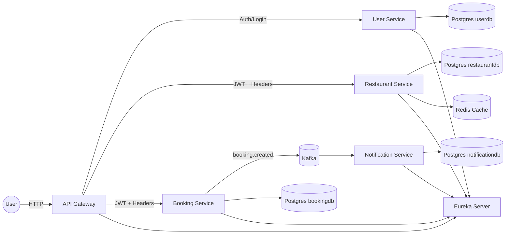

# RBS — Online Restaurant Booking System

Микросервисная система для онлайн-бронирования ресторанов: пользователи выбирают ресторан и столик, создают бронирование, делают предзаказ блюд, получают уведомления, менеджеры ресторанов управляют своим рестораном, изменяют меню, столы и все что связано с их рестораном, а администраторы управляют справочными данными (рестораны, меню, столы).  
Проект демонстрирует современные практики построения распределённых систем на **Java + Spring Boot**: сервис-дискавери, API Gateway, межсервисное взаимодействие, кэширование, события (Kafka), контейнеризация (Docker).

---

## Содержание
- [Цели проекта](#цели-проекта)
- [Технологический стек](#технологический-стек)
- [Микросервисы](#микросервисы)
    - [Eureka Server](#1-eureka-server-discovery-service)
    - [API Gateway](#2-api-gateway)
    - [Restaurant Service](#3-restaurant-service)
    - [Booking Service](#4-booking-service)
    - [User Service](#5-user-service)
    - [Notification Service](#6-notification-service)
    - [Common Module](#7-common-module)
- [Контракты API (пример)](#контракты-api-пример)
- [Безопасность](#безопасность)
- [Кэширование](#кэширование)
- [Событийная модель (Kafka)](#событийная-модель-kafka)
- [Конфигурация и окружение](#конфигурация-и-окружение)
- [Docker / Docker Compose](#docker--docker-compose)
- [Наблюдаемость (Actuator)](#наблюдаемость-actuator)
- [Тестирование](#тестирование)

---

## Цели проекта

1. **Построить микросервисную архитектуру** для предметной области “онлайн-бронирование ресторанов”.
2. Реализовать ключевые инфраструктурные паттерны:
    - Service Discovery (Eureka)
    - API Gateway (Spring Cloud Gateway)
    - Cache-aside (Redis)
    - Event-driven (Kafka)
3. Показать **безопасность и разграничение доступа**: роли USER/ADMIN, фильтры на Gateway.
4. Обеспечить развертывание всей системы одной командой через Docker Compose.
5. Продемонстрировать тестирование, наблюдаемость и готовность к масштабированию.

---

## Технологический стек

**Язык и платформа**
- Java 17
- Gradle multi-module (Kotlin DSL)

**Backend**
- Spring Boot (3.x)
- Spring Data JPA (Hibernate)
- Spring Security
- Spring Cloud:
    - Eureka Client/Server
    - OpenFeign (для синхронных вызовов между сервисами)
    - LoadBalancer

**Инфраструктура**
- PostgreSQL (один сервер, несколько баз данных: `userdb`, `bookingdb`, `restaurantdb`, `notificationdb`)
- Redis (кэш справочных данных)
- Kafka (KRaft mode, без ZooKeeper)

**Контейнеризация**
- Docker / Docker Compose
- Универсальный Dockerfile для сборки любого модуля

**Наблюдаемость**
- Spring Boot Actuator (`/actuator/health`, `/actuator/metrics`, …)

---

# 🧩 Mermaid-диаграмма архитектуры (для README.md)

---

## Микросервисы

Ниже — назначение каждого сервиса и **зависимости**, которые обычно используются в каждом модуле.

> Примечание: зависимости перечислены как “минимально корректный набор”.  
> Ты можешь добавлять/убирать зависимости по мере реализации функций.

---

### 1) Eureka Server (Discovery Service)

**Назначение:**  
Единая точка регистрации микросервисов. Позволяет сервисам находить друг друга по имени (`lb://user-service` и т.п.) и обеспечивает основу для балансировки и отказоустойчивости.

**Порт:** `8761`  
**UI:** `http://localhost:8761`

**Зависимости**
- `spring-boot-starter-web`
- `spring-cloud-starter-netflix-eureka-server`
- `spring-boot-starter-actuator`
- `spring-boot-starter-test` (tests)

---

### 2) API Gateway

**Назначение:**  
Единая точка входа в систему. Реализует:
- маршрутизацию запросов к нужному микросервису,
- security-фильтры (JWT, роли, ограничения),
- централизованную обработку ошибок,
- (опционально) rate limiting / CORS / трассировку.

**Стек:** reactive (WebFlux / Netty)  
**Порт:** `8080`

**Зависимости**
- `spring-cloud-starter-gateway` (включает WebFlux)
- `spring-boot-starter-security` (reactive security)
- `spring-cloud-starter-netflix-eureka-client`
- `spring-boot-starter-actuator`
- Lombok (compileOnly + annotationProcessor)
- Tests: `spring-boot-starter-test`, `reactor-test`

---

### 3) Restaurant Service

**Назначение:**  
Справочный сервис ресторанов. Управляет:
- ресторанами,
- столами,
- меню и блюдами.

Используется Booking Service для проверки доступности и получения информации о столах.

**Порт:** `8081`

**Хранилища**
- PostgreSQL (`restaurantdb`)
- Redis (кэш для read-heavy данных: рестораны/меню/столы)

**Зависимости**
- `spring-boot-starter-web`
- `spring-boot-starter-data-jpa`
- `postgresql` (runtimeOnly)
- `spring-boot-starter-security` (если часть admin-endpoints защищена)
- `spring-boot-starter-data-redis`
- `spring-cloud-starter-netflix-eureka-client`
- `spring-cloud-starter-openfeign`
- `spring-cloud-starter-loadbalancer`
- `spring-boot-starter-actuator`
- Tests: `spring-boot-starter-test`, Testcontainers (postgres/redis по желанию)

---

### 4) Booking Service

**Назначение:**  
Сервис бронирований. Отвечает за:
- создание/отмену/просмотр бронирований,
- проверку столов (через Restaurant Service или кэшированный snapshot),
- генерацию событий для Notification Service.

**Порт:** `8082`

**Хранилища**
- PostgreSQL (`bookingdb`)

**Зависимости**
- `spring-boot-starter-web`
- `spring-boot-starter-data-jpa`
- `postgresql` (runtimeOnly)
- `spring-boot-starter-security` (если нужно ограничить доступ)
- `spring-cloud-starter-netflix-eureka-client`
- `spring-cloud-starter-openfeign`
- `spring-cloud-starter-loadbalancer`
- `spring-kafka` (если Booking публикует события)
- `spring-boot-starter-actuator`
- Tests: `spring-boot-starter-test`, Testcontainers postgres

---

### 5) User Service

**Назначение:**  
Управление пользователями и правами. Типично включает:
- регистрацию/логин,
- хранение профиля,
- роли `USER`/`ADMIN`,
- выдачу/проверку токенов (JWT).

**Порт:** `8083`

**Хранилища**
- PostgreSQL (`userdb`)

**Зависимости**
- `spring-boot-starter-web`
- `spring-boot-starter-security`
- `spring-boot-starter-data-jpa`
- `postgresql` (runtimeOnly)
- `spring-cloud-starter-netflix-eureka-client`
- `spring-boot-starter-actuator`
- Tests: `spring-boot-starter-test`, Testcontainers postgres

---

### 6) Notification Service

**Назначение:**  
Отправка уведомлений пользователям:
- email / push / websocket (опционально),
- обработка событий Kafka (booking created/updated/cancelled),
- ведение статуса доставки уведомлений (опционально в БД).

**Порт:** `8084`

**Хранилища**
- Kafka (consumer)
- PostgreSQL (`notificationdb`) — опционально, если хранишь историю уведомлений

**Зависимости**
- `spring-boot-starter-actuator`
- `spring-kafka` (consumer + тесты)
- `spring-cloud-starter-netflix-eureka-client` (если сервис регистрируется)
- `spring-boot-starter-web` (необязательно, но удобно для тестовых endpoints)
- (опционально) JPA + postgres, если нужна история уведомлений
- Tests: `spring-boot-starter-test`, `spring-kafka-test`

---

### 7) Common Module

**Назначение:**  
Общая библиотека для переиспользования типов между сервисами (без Spring-контекста).

**Что хранить в `common`:**
- DTO (контрактные модели)
- event-модели Kafka (например `BookingCreatedEvent`)
- общие enum’ы (`BookingStatus`)
- общие ошибки/коды ошибок
- утилиты (минимально)

**Что НЕ хранить:**
- JPA Entities
- Spring `@Service`, `@Component`, конфиги
- репозитории

**Зависимости**
- `java-library`
- Lombok (опционально)
- Tests: `junit-jupiter`

---

## Контракты API (пример)

### Restaurant Service (пример публичных endpoints)
- `GET /restaurants` — список ресторанов
- `GET /restaurants/{id}` — ресторан
- `GET /restaurants/{id}/menu` — меню
- `GET /restaurants/{id}/tables` — столы

### Admin endpoints
- `POST /restaurants`
- `PUT /restaurants/{id}`
- `DELETE /restaurants/{id}`
- `POST /restaurants/{id}/menu`
- …

### Booking Service (пример)
- `POST /bookings` — создать бронирование
- `GET /bookings/{id}`
- `GET /bookings?userId=...`
- `DELETE /bookings/{id}` — отменить

> В проекте полезно описать “публичные” и “admin” endpoints раздельно.

---

## Безопасность

### Централизованная security через API Gateway

В проекте используется **централизованный подход к безопасности**:
вся аутентификация и авторизация выполняется на уровне **API Gateway**.

**Базовый принцип:**

* API Gateway валидирует **JWT-токен** и извлекает роль пользователя.
* Gateway принимает решение о доступе к маршруту.
* Бизнес-сервисы доверяют Gateway и не выполняют повторную валидацию токена.
* Контекст пользователя (`userId`, `role`) передаётся в сервисы через HTTP-заголовки.

### Реализация в API Gateway

В Gateway реализованы:

* `GlobalFilter` для:

    * извлечения JWT из заголовка `Authorization`,
    * валидации подписи и срока действия токена,
    * извлечения `userId` и `role`,
    * добавления заголовков `X-User-Id` и `X-User-Role` в downstream-запросы.
* `SecurityWebFilterChain` для route-level правил доступа.

### Правила доступа по маршрутам

* **Публичные маршруты (без аутентификации):**

    * `GET /restaurants/**` — чтение данных о ресторанах, меню и столах.

* **Требуют аутентификации (USER / MANAGER / OWNER):**

    * `POST /bookings`
    * `GET /bookings/**`
    * `DELETE /bookings/**` (с проверкой владельца бронирования)

* **Управление ресторанами (MANAGER / OWNER):**

    * `PUT /restaurants/{id}`
    * `POST /restaurants/{id}/menu`
    * `POST /restaurants/{id}/tables`
    * `PUT /restaurants/{id}/menu/**`
    * `DELETE /restaurants/{id}/menu/**`

* **Глобальное администрирование (только OWNER):**

    * создание и удаление ресторанов,
    * управление ролями пользователей,
    * назначение менеджеров ресторанов.

### Роли и модель доступа

В системе используются три роли:

* **USER**

    * просматривает рестораны, меню и столы,
    * создаёт бронирования,
    * просматривает и отменяет **только свои** бронирования.

* **MANAGER**

    * обладает всеми возможностями USER,
    * управляет меню, столами и данными **только тех ресторанов, которые ему назначены**.

* **OWNER**

    * обладает полным доступом ко всем ресторанам,
    * управляет пользователями и ролями,
    * назначает менеджеров ресторанов,
    * выполняет глобальные административные операции.

### Контроль принадлежности (ownership)

Для операций менеджеров используется дополнительная проверка принадлежности ресурса:

* при изменении ресторана API Gateway проверяет, что ресторан назначен текущему менеджеру,
* проверка выполняется через внутренний запрос к User Service,
* OWNER имеет доступ ко всем ресторанам без ограничений.

Такой подход сочетает:

* **RBAC** (role-based access control),
* **ownership-based access control** (доступ к ресурсам по принадлежности),

и позволяет централизовать безопасность без усложнения бизнес-сервисов.

---

## Кэширование

### Где кэшировать
Наиболее логично кэшировать в `Restaurant Service`:
- список ресторанов
- меню ресторана
- список столов

Паттерн: **Cache-Aside**
- чтение: сначала Redis, затем DB → и складываем в Redis
- обновление: при POST/PUT/DELETE инвалидируем кэш

Цель:
- снизить нагрузку на Postgres
- ускорить ответы на “каталог” и “меню” (read-heavy части)

---

## Событийная модель (Kafka)

### События
Booking Service публикует события:
- `booking.created`
- `booking.cancelled`
- `booking.updated` (опционально)

Notification Service подписывается и отправляет уведомление.

### Почему Kafka полезна 
- показывает асинхронную коммуникацию
- повышает отказоустойчивость
- уменьшает связность сервисов

---

## Конфигурация и окружение

### Переменные окружения (пример)
- `EUREKA_URL=http://eureka-server:8761/eureka`
- `DB_HOST=postgres`
- `DB_PORT=5432`
- `DB_USER=postgres`
- `DB_PASS=postgres`
- `KAFKA_BOOTSTRAP=kafka:9092`
- `REDIS_HOST=redis`
- `REDIS_PORT=6379`

---

## Docker / Docker Compose

### Универсальный Dockerfile
В корне лежит один `Dockerfile`, который собирает любой модуль по `ARG MODULE`.

Пример сборки:
- `MODULE=user-service` → `./gradlew :user-service:bootJar`

### Postgres: один сервер, несколько баз
В `docker/postgres/init/01-create-databases.sql` создаются базы:
- `userdb`
- `bookingdb`
- `restaurantdb`
- `notificationdb`

Postgres создаёт их автоматически **на первом запуске** (в новом volume).

### Kafka: KRaft
Kafka в docker-compose запущена в режиме KRaft (без ZooKeeper).

---

## Наблюдаемость (Actuator)

Для каждого сервиса доступны:
- `GET /actuator/health`
- `GET /actuator/info`
- `GET /actuator/metrics`

Почему важно:
- диагностика
- мониторинг
- проверка “живости” сервисов

---

## Тестирование

### Что тестировать
1. **Unit-тесты**: сервисный слой, валидаторы, мапперы
2. **Web-layer tests**: контроллеры (MockMvc / WebTestClient)
3. **Integration tests**:
    - Postgres через Testcontainers
    - Kafka через embedded kafka / testcontainers (по желанию)
    - Redis (опционально)

### Минимальный набор
- по 2–3 unit теста на каждый сервис
- интеграционный тест для Booking (создание брони)
- интеграционный тест Kafka (booking event → notification consumer)

---